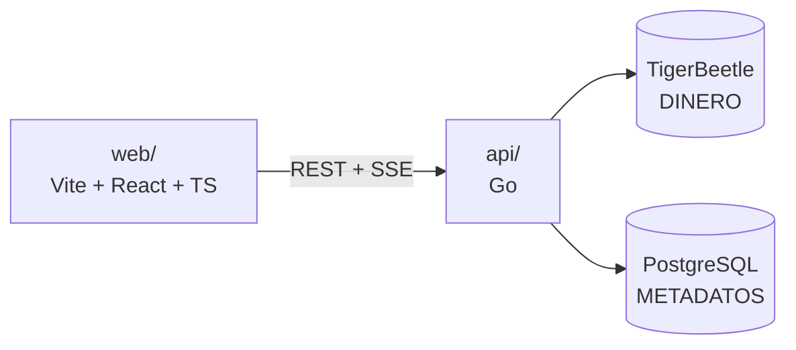

# corebank

Sistema de banca en línea con **ledger contable de doble entrada** sobre
[TigerBeetle](https://tigerbeetle.com), backend en Go y asistente de IA que
opera las cuentas mediante lenguaje natural a través del
[Model Context Protocol](https://modelcontextprotocol.io).

> **Estado:** en construcción. Esta sección se retira cuando el sistema esté
> completo. Ya operativo: infraestructura, capa de dinero (dominio + adaptador
> de TigerBeetle) con tests de integración. Pendiente: API REST, autenticación,
> seeding, asistente y frontend.

## Arquitectura

El dinero y los metadatos viven en almacenes distintos, cada uno haciendo lo
que sabe hacer:



| | TigerBeetle | PostgreSQL |
|---|---|---|
| Es la fuente de verdad de | saldos y movimientos de dinero | identidad, credenciales, metadatos |
| Almacena | cuentas con débitos/créditos posteados y pendientes, transfers de doble entrada, montos en centavos enteros | usuarios, números de cuenta, descripciones, tipos, estados, historial de auditoría |
| No puede | guardar texto, hacer consultas ad-hoc ni joins | garantizar invariantes contables |

**Postgres no tiene columna de saldo.** Es deliberado: el saldo siempre se lee
de TigerBeetle, de modo que no existe la posibilidad de que dos almacenes
discrepen sobre cuánto dinero hay.

### Por qué TigerBeetle y no una tabla

En este diseño **el sobregiro es imposible por construcción, no por
validación**. Las cuentas de cliente se crean con la regla
`debits_must_not_exceed_credits`, así que un retiro por encima del saldo lo
rechaza la propia base de datos financiera. No hay un `if saldo < monto` en el
código de aplicación que alguien pueda olvidar, mover de sitio o dejar fuera de
una ruta nueva.

La contrapartida obligatoria es una cuenta de patrimonio (`world`): en
contabilidad de doble entrada un depósito no puede ser un asiento único, el
dinero tiene que venir de algún lado. Los depósitos se debitan de esa cuenta y
los retiros se le acreditan.

| Operación | Débito | Crédito |
|---|---|---|
| Apertura | `world` | cuenta cliente |
| Depósito | `world` | cuenta cliente |
| Retiro | cuenta cliente | `world` |
| Transferencia | cuenta origen | cuenta destino |

### Confirmación de acciones críticas con transfers en dos fases

Cuando el asistente propone mover dinero, el backend crea un transfer
**pendiente**: los fondos quedan reservados y el saldo disponible ya lo refleja,
pero no llegan a su destino. La interfaz muestra la confirmación y, según lo que
haga el usuario, el transfer se **postea** (el dinero se mueve) o se **anula**
(la reserva se libera). Si el usuario no responde, el propio TigerBeetle libera
la reserva al expirar el plazo, sin necesidad de ningún proceso de limpieza.

Esto da dos garantías que un flujo con una tabla de "pendientes" no da gratis:
los fondos están garantizados en el momento de confirmar, y **el modelo de IA no
puede mover dinero por sí solo** — la confirmación es un paso de servidor, no una
decisión del modelo.

## Requisitos

- **Docker** con al menos **4 GiB** de memoria asignada (6 GiB recomendado).
  TigerBeetle reserva ~2,3 GiB al arrancar.
- Para desarrollo del backend: **Go 1.26+**
- Para desarrollo del frontend: **Node 22+**

## Infraestructura local

```sh
cp .env.example .env
docker compose up -d
```

Levanta PostgreSQL y una réplica de TigerBeetle. El data file de TigerBeetle se
formatea **una sola vez** mediante un servicio de un solo disparo con guarda de
existencia: formatearlo dos veces destruiría el ledger, y arrancar sin
formatearlo falla.

```sh
docker compose down     # parar, conservando los datos
docker compose down -v  # parar y DESTRUIR el ledger y la base de datos
```

### `seccomp=unconfined` en el servicio de TigerBeetle

TigerBeetle usa `io_uring`, y el **perfil seccomp por defecto de Docker bloquea
esas syscalls** (`io_uring_setup`, `_enter`, `_register`). Sin relajarlo, el
formateo aborta con `io_uring is not available: PermissionDenied`. El compose lo
relaja **solo en los servicios de TigerBeetle**; el backend y el frontend
conservan el perfil por defecto, de modo que la excepción queda acotada al único
proceso que la necesita.

## Desarrollo del backend

```sh
cd api
go test ./...
go run ./cmd/tbsmoke   # valida el modelo contable contra TigerBeetle
```

Los tests de integración de la capa de dinero necesitan TigerBeetle corriendo
(`docker compose up -d`). Si no lo encuentran se saltan en lugar de fallar, así
que un checkout sin infraestructura sigue dando `go test ./...` en verde.

### En macOS: flag del linker obligatorio

El cliente Go de TigerBeetle enlaza un archivo estático precompilado cuyos
miembros no están alineados a 8 bytes. El linker actual de Apple lo rechaza:

```
ld: 64-bit mach-o member 'libtb_client.a.o' not 8-byte aligned
```

El linker clásico sí lo acepta, así que en macOS **cualquier** comando de Go que
enlace el cliente necesita:

```sh
export CGO_LDFLAGS="-Wl,-ld_classic"
```

Conviene exportarlo al abrir la terminal de trabajo. No se puede declarar dentro
del código con una directiva `#cgo LDFLAGS`, porque Go mantiene una lista blanca
de flags permitidos ahí y este no está en ella. Solo afecta al desarrollo local:
las imágenes de Docker compilan sobre Linux y no lo necesitan.

### Alpine no es una opción

El cliente Go solo distribuye librerías nativas para **glibc**
(`aarch64-linux`, `x86_64-linux`) — no hay variante musl. Compilar sobre Alpine
falla con todos los tipos del paquete `undefined`, porque las build constraints
excluyen el paquete entero. Las imágenes se basan en Debian.

## Estructura

```
api/                  backend Go (module github.com/JuanKsPty/corebank/api)
  cmd/                binarios: api, seed, tbsmoke
  internal/
    money/            montos como centavos enteros, parseo exacto
    ledger/           dominio del dinero y contrato del backend
    tigerbeetle/      adaptador del cliente de TigerBeetle
  seed/data/          dataset de prueba
web/                  frontend Vite + React + TypeScript
docker-compose.yml
```

## Decisiones técnicas

### Los montos son centavos enteros, nunca floats

Ningún monto se representa como coma flotante en ningún punto del sistema:
centavos en Postgres (`BIGINT`), centavos en TigerBeetle (`u128`), centavos por
la API. El parseo trabaja sobre el **texto** decimal en lugar de sobre un
`float64`, porque la conversión ingenua pierde dinero de verdad:

```
float64(8.87) * 100  ->  886 centavos   (un centavo perdido)
parseo de "8.87"     ->  887 centavos
```

Hay un test que fija esa diferencia para que nadie "simplifique" el parseo a la
versión rota más adelante.

### Identificadores deterministas

El id de una cuenta en el ledger se **deriva** de su número de cuenta
(`4001-6588-5247-0001` → `4001658852470001`) en lugar de generarse. El id de un
movimiento es el UUID de su fila en Postgres, que son exactamente los 128 bits
que TigerBeetle necesita.

Que sean deterministas es lo que hace seguros los reintentos y el re-seeding:
reenviar el mismo movimiento tras una caída se reporta como "ya aplicado" en vez
de mover el dinero dos veces.
